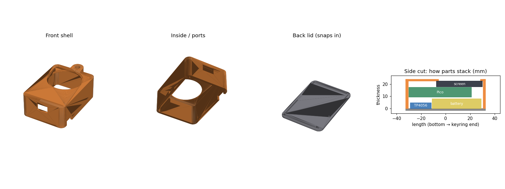

# Animated Pixel Keychain

A tiny keychain with a 1.28" round screen that plays pixel-art animations. Press the button to switch to
the next one. It runs on a DFRobot Beetle ESP32-C6 (or a Raspberry Pi Pico), charges over USB-C, and lasts
hours on a small LiPo.

<!-- TODO: replace with your own video / GIF of the real keychain -->
<p align="center">
  
  &nbsp;&nbsp;
  
</p>
<p align="center"><i>Demo animations rendered with <code>tools/preview.py</code>. Real-hardware video below.</i></p>

## Demo

<!-- TODO: drag your video into this README on GitHub (it uploads it for you), or put it in media/ and link it -->
https://github.com/USER/REPO/assets/VIDEO_ID

| | | |
|---|---|---|
| <!-- TODO -->  | <!-- TODO -->  | <!-- TODO -->  |
| Wiring the screen | Soldering the Beetle | Finished keychain |

## Features

- **Smooth pixel-art animations** on a 240x240 round IPS screen
- **Button cycles through animations** (the board's BOOT / BOOTSEL button, no extra wiring)
- **Two layers per animation**, each with its own frame timer (e.g. a character inside a spinning aura)
- **Any size** - layers are scaled on the device, so a small sprite can fill the screen without taking more flash
- **Bring your own GIFs** - one Python script converts them, fits them to the circle and checks the result
- **Runs on two boards** - Beetle ESP32-C6 (tiny, built-in battery charging) or Raspberry Pi Pico / Pico 2
- **Preview on your PC** before flashing
- **3D-printable case**

## Hardware

| Part | Price (QAR) |
|---|---|
| 1.28" round GC9A01 display (240x240, SPI) | 55 |
| DFRobot Beetle ESP32-C6 | 29 |
| 3.7V LiPo battery | 15 |
| Jumper wires, slide switch, header pins | ~13 |
| **Total** | **~112** |

Full list with links: [docs/parts.md](docs/parts.md)

## Wiring

| Screen | Beetle ESP32-C6 | Raspberry Pi Pico |
|---|---|---|
| VCC | 3V3 | 3V3(OUT) |
| GND | GND | GND |
| SCL | 23 | GP18 |
| SDA | 22 | GP19 |
| CS | 21 | GP17 |
| DC | 20 | GP20 |
| RST | 19 | GP21 |
| BL *(if present)* | 7 | GP22 |

Soldering guide, battery and pinout details: [docs/wiring.md](docs/wiring.md)

## Flashing

1. Install the [Arduino IDE](https://www.arduino.cc/en/software).
2. **Boards Manager:** install **esp32 by Espressif (3.x)** for the Beetle, or **Raspberry Pi Pico/RP2040/RP2350 by Earle Philhower** for a Pico.
3. **Library Manager:** install **GFX Library for Arduino**.
4. Open `firmware/PokemonKeychain/PokemonKeychain.ino`.
5. Tools → Board → **DFRobot Beetle ESP32-C6** (or your Pico), pick the port, **Upload**.

If the Beetle doesn't show up: hold **BOOT**, tap **RST**, release BOOT, and try again (and check the cable carries data).

## Adding your own animations

```bash
pip install pillow numpy
python tools/gif2keychain.py tools/animations.json -o firmware/PokemonKeychain/sprites.h
python tools/preview.py            # optional: renders media/preview_*.gif
```

Each entry in `tools/animations.json` is a **show** with an optional `back` layer, a `front` layer and two ring colours:

```json
{
  "name": "Spirit",
  "ring": ["#5AC8FF", "#123A80"],
  "back":  { "file": "tools/examples/ring.gif", "radius": 96, "center": [100, 100] },
  "front": { "file": "tools/examples/spirit.gif", "scale": 3 }
}
```

| Option | What it does |
|---|---|
| `scale` | `"fit"` = biggest size that fits the circle, or a number like `1.45` |
| `radius` + `center` | scale and move a circular GIF so its edge lines up with the screen's edge |
| `native_pixel` | `"auto"` shrinks upscaled pixel art back to its real pixels (sharper and much smaller) |
| `crop` | `[x, y, w, h]` part of the image to use |
| `frame_step` | keep every Nth frame to save space (speed stays the same) |
| `colors` | limit the palette (fewer colours compress better) |
| `offset` | nudge `[x, y]` in screen pixels |

Put your own GIFs in `tools/my_gifs/` (it's git-ignored, so you don't accidentally publish art that isn't yours).

## 3D-printed case

`case/` has a two-part case (front shell + snap-in lid), the script that generates it and the STL files.
It's designed around the Pico + 1000 mAh battery (about 46 x 65 x 26 mm). With the Beetle and a smaller
battery it can shrink to roughly 42 x 45 x 15 mm - change the numbers at the top of `case/case.py`.

<p align="center"></p>

## How it works

- **Frames are pre-decoded on the PC**, not on the microcontroller. Each frame is stored as run-length pairs
  `[count, value]`, and every frame after the first only stores what changed (`255` = "same as before").
  A 24-frame full-screen animation where only small parts move fits in ~60 KB.
- **Only changed pixels are redrawn.** Each frame, the firmware works out which part of each row changed and
  sends just that over SPI.
- **Two layers, two clocks.** The back and front layers advance on their own timers, so animations with
  different lengths loop smoothly together.
- **Scaling happens while drawing** (fixed-point, 1/256 steps), so enlarging a sprite costs no extra flash.
- `tools/gif2keychain.py` decodes every frame again after encoding to make sure it's pixel-perfect.

## Troubleshooting

| Problem | Fix |
|---|---|
| Upload works but the screen stays black | Press **RST**. Check VCC → 3V3 and GND. |
| Screen lights up but shows nothing / garbage | One of SCL, SDA, CS, DC, RST is swapped - recheck the table |
| Stripes or glitches | Long jumper wires: set `SPI_SPEED` to `20000000` in the .ino |
| No port in the Arduino IDE | Try another USB-C cable (data, not charge-only), or BOOT + RST |
| "Sketch too big" | Use `frame_step` / `colors` in `animations.json`, or Tools → Partition Scheme → Huge APP |

## Project structure

```
firmware/PokemonKeychain/   Arduino sketch + generated sprites.h
tools/gif2keychain.py       GIF → sprites.h converter
tools/preview.py            renders what the screen will show
tools/animations.json       which GIFs to use and how
tools/examples/             original demo animations
case/                       3D-printable case (script + STL)
docs/                       parts list, wiring & soldering
media/                      photos, videos, previews
```

## Credits

- Display driver: [GFX Library for Arduino](https://github.com/moononournation/Arduino_GFX) by moononournation
- Demo animations in `tools/examples/` were made for this project.
- On my own keychain I play Pokémon sprites (via [PokeAPI/sprites](https://github.com/PokeAPI/sprites)) and fan art I found online.
  Those aren't included here because they're not mine to share - Pokémon © Nintendo / Game Freak / The Pokémon Company.
  <!-- TODO: credit the artists of any fan art you show in your photos/videos -->

## License

Code: [MIT](LICENSE)
